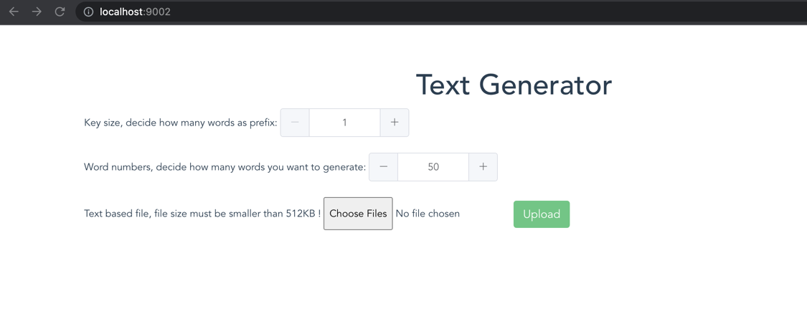
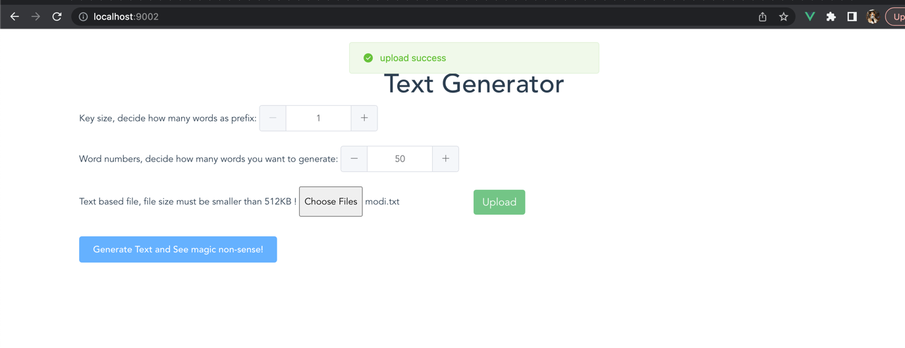
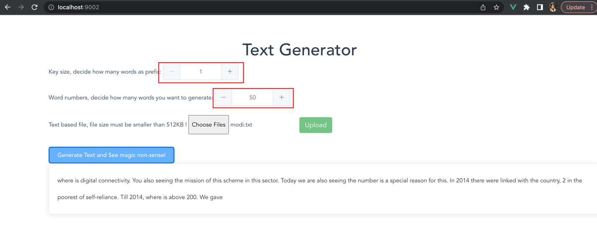
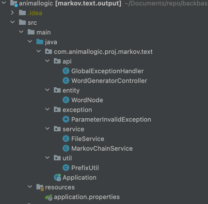

# Text Generator 
## 

A service will generate some randome text based on the input via Markov chain.

- SpringBoot as web framework, SpringBoot version 2.6.12
- Java version 11.0.15
- mvn version 3.2.5

## How to run

Project is dockerized. docker deamon is needed.

####Docker version:
- Version:           19.03.5
- API version:       1.40

### Steps

- Maven build jar and docker image. Use maven profile docker-image.

```sh
mvn clean install -Pdocker-image
```

- After that, we can verify the image build.

```sh
docker images
```
like below:


- Run docker images.
```sh
docker run -d -p 8000:50000 -t demo:0.0.1-SNAPSHOT
```

- Open Brower to verify the result.
```sh
http://localhost:9002
```

upload any text file( size must be smaller than 512KB )


 

click generate button and see the text



change the key size and generate word size to see any difference. Key size maximum is 6, and word
number is at most 100.



## Project Structure

Core logic is MarkovChainService, which is build a Markoy node chain,
each( key size ) word/words will be a prefix, and its postfix is only depending on its predecessor.


